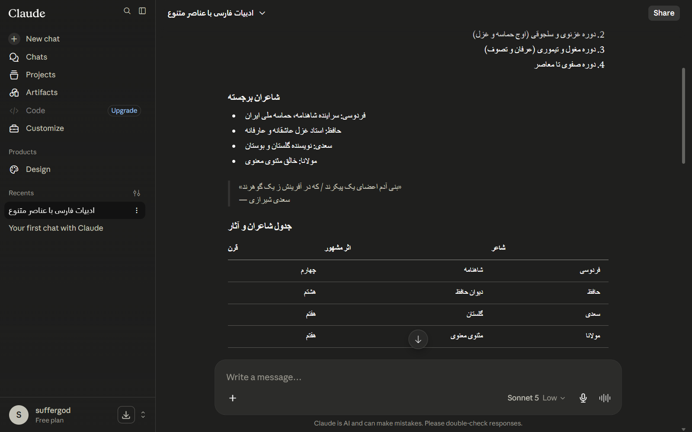
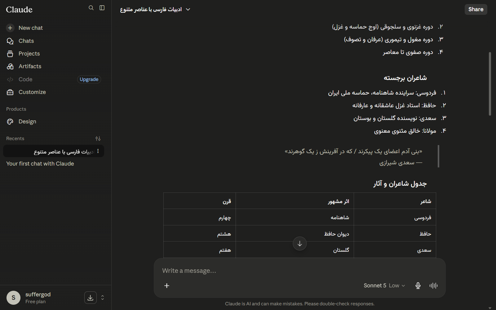

<p align="center">
<pre>
 _____  _  _____   _____ _____ _____ __   __ _____ _____ 
|  __ \| ||  ___| /  ___|_   _/  __ \\ \\ / /|_   _|_   _|
| |  \\/| || |__   \\ `--.  | | | /  \\/  \\ V /   | |   | |  
| | __ | ||  __|   `--. \\ | | | |      \\ /    | |   | |  
| |_\\ \\| || |___  /\\__/ / | | | \\__\\   | |   _| |_ _| |_ 
 \\____/\\_| \\____/  \\____/  \\_/  \\____/  \\_/   \\___/ \\___/
</pre>
</p>

<p align="center">
  
  <a href="LICENSE"></a>
  <a href="PRIVACY.md"></a>
  <a href="https://www.linkedin.com/in/mahancn/"></a>
</p>

<p align="center">
  <b>راست‌چین</b> &middot; راست‌چین خودکار، فونت وزیرمتن و اعداد فارسی<br>
  برای متن‌های فارسی در پلتفرم‌های چت هوش مصنوعی. خصوصی، سریع، متن‌باز.
</p>

---

## کار اصلی چیه؟

متن فارسی در چت‌بات‌های هوش مصنوعی به‌صورت پیش‌فرض اشتباه نمایش داده می‌شه. راست‌چین این مشکل رو حل می‌کنه.

<table>
  <tr>
    <td align="center"><b>بدون راست‌چین</b></td>
    <td align="center"><b>با راست‌چین</b></td>
  </tr>
  <tr>
    <td></td>
    <td></td>
  </tr>
</table>

## ویژگی‌ها

<table>
  <tr>
    <td align="center" width="50%">
      <h3>🔤 راست‌چین هوشمند</h3>
      <p>تحلیل هر پاراگراف بر اساس تعداد کاراکتر. متن ترکیبی فارسی/انگلیسی به‌طور طبیعی نمایش داده می‌شه.</p>
    </td>
    <td align="center" width="50%">
      <h3>🔤 فونت وزیرمتن</h3>
      <p>فقط برای گلیف‌های فارسی/عربی اعمال می‌شه. متن انگلیسی فونت اصلی سایت رو حفظ می‌کنه.</p>
    </td>
  </tr>
  <tr>
    <td align="center" width="50%">
      <h3>📝 لیست‌های فارسی</h3>
      <p>لیست‌های مرتب‌شده به‌صورت ۱. ۲. ۳. در متن‌های راست‌چین نمایش داده می‌شن.</p>
    </td>
    <td align="center" width="50%">
      <h3>💻 کد همون LTR می‌مونه</h3>
      <p>بلوک‌های کد، KaTeX و کدهای inline هرگز flipped نمی‌شن.</p>
    </td>
  </tr>
  <tr>
    <td align="center" width="50%">
      <h3>⚡ تغییر وضعیت زنده</h3>
      <p>فعال/غیرفعال کردن برای هر سایت بدون نیاز به ریلود صفحه.</p>
    </td>
    <td align="center" width="50%">
      <h3>🎯 نمایش سایت فعال</h3>
      <p>پاپ‌آپ نشون می‌ده که روی کدوم سایت پشتیبنی‌شده هستی.</p>
    </td>
  </tr>
  <tr>
    <td align="center" width="50%">
      <h3>🌗 رابط کاربری سازگار</h3>
      <p>پاپ‌آپ با تم روشن/تیره سیستم‌تون تطبیق پیدا می‌کنه.</p>
    </td>
    <td align="center" width="50%">
      <h3>🌐 دوزبانه</h3>
      <p>انگلیسی و فارسی، تشخیص خودکار از لوکال مرورگر.</p>
    </td>
  </tr>
  <tr>
    <td align="center" width="50%">
      <h3>🔒 بدون داده</h3>
      <p>بدون آنالیتیکس، بدون تله‌متری، بدون درخواست شبکه. مکالمات شما هرگز مرورگرتون رو ترک نمی‌کنن.</p>
    </td>
    <td></td>
  </tr>
</table>

## سایت‌های پشتیبنی‌شده

| سایت | دامنه |
|------|--------|
|  ChatGPT | `chatgpt.com` |
|  Claude | `claude.ai` |
|  Gemini | `gemini.google.com` |
|  DeepSeek | `chat.deepseek.com` |
|  NotebookLM | `notebooklm.google.com` |

## نصب

**از Chrome Web Store**

[👉 **نصب راست‌چین از Chrome Web Store**](https://chromewebstore.google.com/detail/rustchin-persian-rtl-vazi/mhmnoojpobfgkpdkdmaaejiimolgagck)

**از سورس**

1. دانلود یا کلون این ریپازیتوری
2. باز کردن `chrome://extensions`
3. فعال کردن **Developer mode**
4. کلیک روی **Load unpacked** و انتخاب این پوشه
5. بازدید از یک سایت پشتیبنی‌شده و شروع چت کردن به فارسی

## حریم خصوصی

- **بدون دسترسی شبکه.** تنها `fetch` فونت لوکال رو لود می‌کنه.
- **دو تا پرمیشن.** `storage` برای ذخیره تنظیمات. `activeTab` برای تشخیص سایتی که روش هستی.
- **متن‌باز (MIT).** همه کد عمومی هست. ببین [PRIVACY.md](PRIVACY.md).

## معماری

```
RustChin/
├── core/engine.js              موتور مشترک
├── sites/
│   ├── chatgpt.js              تنظیمات ChatGPT
│   ├── claude.js               تنظیمات Claude
│   ├── gemini.js               تنظیمات Gemini
│   ├── deepseek.js             تنظیمات DeepSeek
│   └── notebooklm.js           تنظیمات NotebookLM
├── fonts/Vazirmatn-Variable.woff2
├── popup/                      رابط کاربری پاپ‌آپ
├── background.js               انتقال وضعیت
└── manifest.json
```

هر فایل تنظیمات سایت یه فایل کوچیک و declarative هست. اضافه کردن سایت جدید ~۹۰ خط کد، نه کپی کردن یه اسکریپت بزرگ.

## اضافه کردن چت‌بات جدید

1. ساخت `sites/yoursite.js`:

```js
RustChin.start({
  siteId: "yoursite",
  host: "yoursite.com",
  containers: ".message, .markdown",
  exclude: "pre, code, .katex, .math",
  editableSelector: 'textarea, [contenteditable="true"]',
  numberedLists: true,
  css: `
    @font-face {
      font-family: 'Vazirmatn';
      src: url({{FONT}}) format('woff2');
      font-weight: 100 900; font-display: swap;
      unicode-range: U+0600-06FF, U+0750-077F, U+08A0-08FF,
        U+FB50-FDFF, U+FE70-FEFF, U+200C-200F;
    }
    .bidi-scope .rc-done { font-family: 'Vazirmatn', sans-serif !important; }
    .bidi-scope ol[dir="rtl"] { list-style-type: persian !important; }
    .bidi-scope p { unicode-bidi: isolate !important; text-align: start !important; }
  `,
});
```

2. ثبت کردنش در `manifest.json` و `popup/popup.js`.

## عملکرد

- **اسکن Memoized** هر المان فقط یک‌بار آنالیز می‌شه، فقط وقتی متن تغییر کنه دوباره آنالیز می‌شه
- **Debatched mutations** تغییرات DOM در یک بچ به یک میکروتسک تبدیل می‌شن
- **Frame-throttled typing** اجرای زنده ورودی حداقل یک‌بار در هر انیمیشن فریم
- **Non-blocking first paint** اسکن اولیه به `requestIdleCallback` موکول می‌شه

## برندهای تجاری

ChatGPT، Claude، Gemini، DeepSeek و NotebookLM برندهای تجاری مالکان respectivas هستن. راست‌چین با این سرویس‌ها وابستگی یا تأییدیه نداره.

## اعتبارات

- **لوگو** طراحی توسط [MahanCN](https://www.linkedin.com/in/mahancn/)
- **فونت** — [وزیرمتن](https://github.com/rastikerdar/vazirmatn) توسط سعید بهمن‌آباد

## لایسنس

[MIT](LICENSE)

## مشارکت

اینیو و پول‌ریکوئست‌ها خوش‌باخت می‌شن. قبل از ارسال روی همه سایت‌های پشتیبنی‌شده تست کنید.

<p align="center">
  ساخته‌شده با ❤️ برای جامعه هوش مصنوعی فارسی‌زبان
</p>