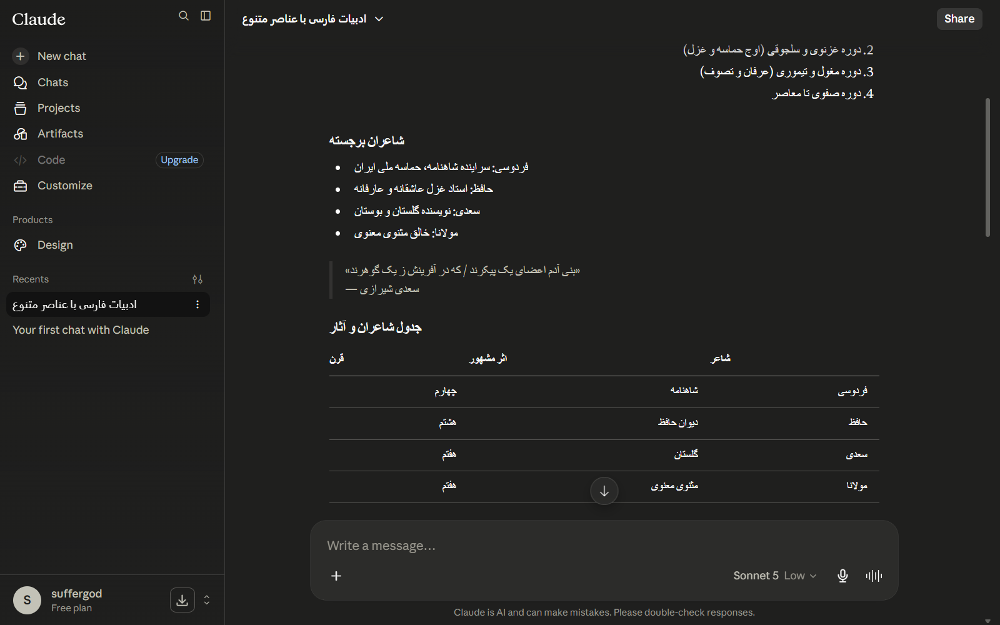
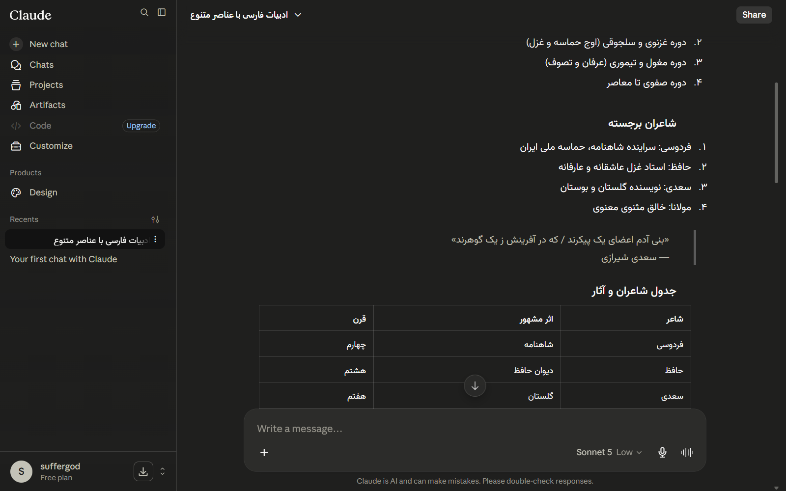

<div dir="rtl">

<p align="center">
  <a href="https://chromewebstore.google.com/detail/rustchin-persian-rtl-vazi/mhmnoojpobfgkpdkdmaaejiimolgagck">
    
  </a>
</p>

<h1 align="center">راست‌چین | RustChin</h1>

<p align="center">
  <b>راست‌چین‌سازی هوشمند، ۵ فونت متغیر فارسی و شماره‌گذاری خودکار برای وب‌سایت‌های هوش مصنوعی</b><br>
  سبک، پرسرعت، کاملاً متن‌باز و با امنیت ۱۰۰٪ بدون ارسال حتی یک بایت داده.
</p>

<p align="center">
  <a href="https://chromewebstore.google.com/detail/rustchin-persian-rtl-vazi/mhmnoojpobfgkpdkdmaaejiimolgagck">
    
  </a>
</p>

<p align="center">
  
  
  <a href="LICENSE"></a>
  <a href="PRIVACY.md"></a>
  <a href="https://www.linkedin.com/in/mahancn/"></a>
</p>

---

## چرا راست‌چین؟

متن‌های فارسی در چت‌بات‌های هوش مصنوعی به‌طور پیش‌فرض چپ‌به‌راست (LTR)، با فونت‌های نامناسب، نقطه‌گذاری‌های وارونه در انتهای جملات و لیست‌های نامرتب نمایش داده می‌شن. این وضعیت هنگام تایپ متن‌های ترکیبی (فارسی و انگلیسی) آزاردهنده‌تر هم می‌شه.

**راست‌چین** این مشکلات رو بدون دستکاری یا شکستن ساختار صفحات برطرف می‌کنه:
- **جهت‌دهی هوشمند:** هر پاراگراف یا پیام بر اساس محتوای خودش به‌طور دقیق راست‌چین می‌شه.
- **ایزوله‌سازی کد و ریاضی:** بلوک‌های کد (`pre` و `code`) و فرمول‌های ریاضی (KaTeX و Math) دست‌نخورده و کاملاً چپ‌به‌راست (LTR) باقی می‌مونن.
- **تایپوگرافی اصیل:** ۵ قلم متغیر فارسی مستقیماً درون افزونه قرار دارن تا متن‌ها با خوانایی بالا نمایش داده بشن.

<table>
  <tr>
    <th align="center" width="50%">بدون راست‌چین (پیش‌فرض سرویس‌ها)</th>
    <th align="center" width="50%">با راست‌چین (خوانا، استاندارد و مرتب)</th>
  </tr>
  <tr>
    <td align="center"></td>
    <td align="center"></td>
  </tr>
</table>

---

## قابلیت‌های کلیدی

<table>
  <thead>
    <tr>
      <th align="right" width="40%">قابلیت</th>
      <th align="right" width="60%">توضیحات عملکرد</th>
    </tr>
  </thead>
  <tbody>
    <tr>
      <td align="right">🔤 <b>تشخیص هوشمند جهت (Smart RTL)</b></td>
      <td align="right">بررسی لحظه‌ای نسبت حروف فارسی به انگلیسی؛ متن‌های ترکیبی و علائم نگارشی مثل نقطه و پرانتز در جای درست قرار می‌گیرند.</td>
    </tr>
    <tr>
      <td align="right">🎨 <b>۵ فونت متغیر فارسی (Variable)</b></td>
      <td align="right">پشتیبانی همزمان از ۵ قلم محبوب: <b>وزیرمتن</b>، <b>استعداد</b>، <b>ساحل</b>، <b>آراد</b> و <b>میخک</b> با تنظیم خودکار وزن از ۱۰۰ تا ۹۰۰.</td>
    </tr>
    <tr>
      <td align="right">🔢 <b>شماره‌گذاری فارسی لیست‌ها</b></td>
      <td align="right">تبدیل خودکار شماره لیست‌های ترتیبی در متن‌های فارسی به اعداد فارسی (۱. ۲. ۳.) بدون تغییر لیست‌های انگلیسی.</td>
    </tr>
    <tr>
      <td align="right">💻 <b>ایزوله‌سازی کامل کد و فرمول‌ها</b></td>
      <td align="right">تمام بلوک‌های کدنویسی، تکه‌کدهای درون‌خطی و فرمول‌های ریاضی از راست‌چین‌سازی مستثنی بوده و ساختار LTR را حفظ می‌کنند.</td>
    </tr>
    <tr>
      <td align="right">🛠️ <b>استودیو و داشبورد تایپوگرافی</b></td>
      <td align="right">محیط تنظیمات اختصاصی همراه با سندباکس تست زنده، تنظیم مقیاس اندازه قلم و ارتفاع خطوط با دکمه بازنشانی پیش‌فرض.</td>
    </tr>
    <tr>
      <td align="right">⚡ <b>تغییر درلحظه بدون رفرش (Live Sync)</b></td>
      <td align="right">تغییر فونت یا خاموش/روشن کردن افزونه فوراً و بدون نیاز به بازخوانی صفحه در تمام زبانه‌های باز اعمال می‌شود.</td>
    </tr>
    <tr>
      <td align="right">🟢 <b>کلیدهای لمسی با فیزیک اپل</b></td>
      <td align="right">سوییچ‌های قابل درگ با انیمیشن فنری Apple HIG که با رنگ اختصاصی هر چت‌بات (سبز، خاکی، آبی و نیلی) روشن می‌شوند.</td>
    </tr>
    <tr>
      <td align="right">🌗 <b>هماهنگی با پوسته تیره و روشن</b></td>
      <td align="right">تنظیم خودکار با تم سیستم‌عامل با امکان انتخاب دستی حالت تاریک یا روشن و آیکون‌های وکتور رسپانسیو.</td>
    </tr>
    <tr>
      <td align="right">🔒 <b>امنیت مطلق و بدون جمع‌آوری داده</b></td>
      <td align="right">فاقد هرگونه کد آمارگیری، سرور خارجی یا رهگیری اطلاعات؛ مکالمات شما به طور کامل روی رایانه خودتان باقی می‌ماند.</td>
    </tr>
  </tbody>
</table>

> [!TIP]
> برای دسترسی به استودیو تایپوگرافی، کافیست روی آیکون تنظیمات در بالای پاپ‌آپ کلیک کنید یا در منوی راست‌کلیک روی آیکون افزونه گزینه **Options** را انتخاب نمایید.

---

## سرویس‌های پشتیبانی‌شده

<table>
  <thead>
    <tr>
      <th align="right">پلتفرم</th>
      <th align="center">دامنه</th>
      <th align="center">رنگ تاگل اختصاصی</th>
      <th align="center">وضعیت سازگاری</th>
    </tr>
  </thead>
  <tbody>
    <tr>
      <td align="right">
        <picture>
          <source media="(prefers-color-scheme: dark)" srcset="icons/chatgpt-dark.svg">
          
        </picture> <b>ChatGPT</b>
      </td>
      <td align="center"><code>chatgpt.com</code></td>
      <td align="center"></td>
      <td align="center">✅ سازگار کامل (شامل Canvas، ProseMirror و جداول)</td>
    </tr>
    <tr>
      <td align="right"> <b>Claude</b></td>
      <td align="center"><code>claude.ai</code></td>
      <td align="center"></td>
      <td align="center">✅ سازگار کامل (شامل پروژه‌ها و پنل Artifacts)</td>
    </tr>
    <tr>
      <td align="right"> <b>Google Gemini</b></td>
      <td align="center"><code>gemini.google.com</code></td>
      <td align="center"></td>
      <td align="center">✅ سازگار کامل (شامل ویرایشگر چندخطی Quill)</td>
    </tr>
    <tr>
      <td align="right"> <b>Gemini Notebook</b> (NotebookLM)</td>
      <td align="center"><code>notebook.google.com</code></td>
      <td align="center"></td>
      <td align="center">✅ سازگار کامل (شامل دامنه جدید و قدیم)</td>
    </tr>
    <tr>
      <td align="right"> <b>DeepSeek</b></td>
      <td align="center"><code>chat.deepseek.com</code></td>
      <td align="center"></td>
      <td align="center">✅ سازگار کامل (شامل جعبه ورودی و فرمول‌ها)</td>
    </tr>
  </tbody>
</table>

---

## فونت‌های ارائه‌شده

تمامی قلم‌ها به شکل بسته متغیر (Variable WOFF2 با وزن‌های ۱۰۰ تا ۹۰۰) در افزونه تعبیه شده‌اند و هیچ نیازی به دانلود اضافه یا نصب فونت روی سیستم‌عامل ندارند:

<details open>
<summary><b>نمایش مشخصات و طراحان ۵ قلم متغیر (کلیک کنید)</b></summary>
<br>

<table>
  <thead>
    <tr>
      <th align="right">نام قلم</th>
      <th align="right">طراح فونت</th>
      <th align="right">ویژگی و کاربرد</th>
      <th align="center">منبع متن‌باز</th>
    </tr>
  </thead>
  <tbody>
    <tr>
      <td align="right"><b>وزیرمتن (Vazirmatn)</b></td>
      <td align="right">زنده‌یاد صابر راستی‌کردار</td>
      <td align="right">فونت استاندارد وب فارسی؛ خوانایی بی‌نقص در انواع ابعاد متن و گفتگوهای طولانی.</td>
      <td align="center"><a href="https://github.com/rastikerdar/vazirmatn">گیت‌هاب</a></td>
    </tr>
    <tr>
      <td align="right"><b>استعداد (Estedad)</b></td>
      <td align="right">امین عابدی</td>
      <td align="right">مدرن، پویا و صمیمی؛ انتخابی عالی برای مطالعه پیوسته و تحلیل متون فنی.</td>
      <td align="center"><a href="https://github.com/aminabedi68/Estedad">گیت‌هاب</a></td>
    </tr>
    <tr>
      <td align="right"><b>ساحل (Sahel)</b></td>
      <td align="right">زنده‌یاد صابر راستی‌کردار</td>
      <td align="right">کلاسیک، چشم‌نواز با ریشه‌های سنتی خط نسخ و حس نوشتاری دلنشین.</td>
      <td align="center"><a href="https://github.com/rastikerdar/sahel-font">گیت‌هاب</a></td>
    </tr>
    <tr>
      <td align="right"><b>آراد (Arad)</b></td>
      <td align="right">مصطفی درویشی</td>
      <td align="right">ساختار هندسی، جسورانه و نوگرا؛ مناسب رابط‌های کاربری مدرن و عنوان‌ها.</td>
      <td align="center"><a href="https://github.com/MDarvishi5124/Arad">گیت‌هاب</a></td>
    </tr>
    <tr>
      <td align="right"><b>میخک (Mikhak)</b></td>
      <td align="right">امین عابدی</td>
      <td align="right">فرم‌های نرم، روان و بدون زوایای خشک؛ حس محاوره‌ای و دوستانه.</td>
      <td align="center"><a href="https://github.com/aminabedi68/Mikhak">گیت‌هاب</a></td>
    </tr>
  </tbody>
</table>

</details>

---

## روش‌های نصب

### روش اول: نصب مستقیم از کروم وب‌استور (پیشنهادی)
ساده‌ترین روش با دریافت خودکار به‌روزرسانی‌ها:  
👉 [**صفحه رسمی افزونه راست‌چین در Chrome Web Store**](https://chromewebstore.google.com/detail/rustchin-persian-rtl-vazi/mhmnoojpobfgkpdkdmaaejiimolgagck)

### روش دوم: نصب دستی از سورس‌کد (حالت توسعه‌دهنده)

<details>
<summary><b>مشاهده مراحل نصب سورس‌کد (کلیک کنید)</b></summary>
<br>

<ol>
  <li>مخزن پروژه را دریافت یا کلون کنید:</li>
</ol>

<div dir="ltr">

```bash
git clone https://github.com/Suffergod/RustChin.git
```

</div>

<ol start="2">
  <li>در مرورگر کروم یا مرورگرهای مبتنی بر کرومیوم (Edge, Brave, Arc) به نشانی زیر بروید:</li>
</ol>

<div dir="ltr">

```text
chrome://extensions
```

</div>

<ol start="3">
  <li>گزینه <b>Developer mode</b> را در گوشه بالای صفحه فعال کنید.</li>
  <li>روی دکمه <b>Load unpacked</b> کلیک کرده و پوشه دانلود شده افزونه را انتخاب کنید.</li>
  <li>وارد یکی از چت‌بات‌های پشتیبانی‌شده شوید و از تایپ فارسی لذت ببرید!</li>
</ol>

</details>

---

## پرسش‌های متداول (FAQ)

<details>
<summary><b>آیا این افزونه پیام‌های من را می‌خواند یا ذخیره می‌کند؟</b></summary>
<p>
خیر، به‌هیچ‌وجه. راست‌چین به صورت کاملاً مستقل و لوکال روی مرورگر شما اجرا می‌شود و هیچ ارتباط سروری یا ابزار تحلیلی ندارد. تنها دسترسی‌های افزونه شامل <code>storage</code> برای ذخیره محلی تنظیمات و <code>activeTab</code> برای تشخیص سایت باز شده است.
</p>
</details>

<details>
<summary><b>چگونه فونت یا اندازه متن را تغییر دهم؟</b></summary>
<p>
روی آیکون افزونه کلیک کنید و از منوی بازشونده فونت، قلم دلخواهتان را انتخاب کنید. همچنین با باز کردن داشبورد (آیکون چرخ‌دنده)، می‌توانید مقیاس فونت و فاصله خطوط را مطابق سلیقه خود شخصی‌سازی کنید.
</p>
</details>

<details>
<summary><b>آیا کدهای برنامه‌نویسی راست‌چین می‌شوند؟</b></summary>
<p>
خیر. تمام تگ‌های <code>pre</code>، <code>code</code> و فرمول‌های KaTeX با قوانین سخت‌گیرانه ایزوله شده‌اند و همیشه با فونت اختصاصی مونو و جهت چپ‌به‌راست نمایش داده می‌شوند.
</p>
</details>

---

## ساختار پروژه

<div dir="ltr">

```text
RustChin/
├── core/
│   └── engine.js              # MutationObserver engine, direction detection, DOM isolation
├── sites/                     # Declarative chatbot targets
│   ├── chatgpt.js
│   ├── claude.js
│   ├── gemini.js
│   ├── notebooklm.js
│   └── deepseek.js
├── fonts/                     # Bundled variable font assets (WOFF2)
├── icons/                     # Brand SVG vectors & Solar UI icons
├── popup/                     # Quick action popover with drag-toggles
├── options/                   # Full settings studio & typography sandbox
├── background.js              # Extension service worker (MV3)
└── manifest.json              # Extension manifest specifications
```

</div>

---

## تقدیر و تشکر

- **طراحی نماد و لوگو:** [ماهان دولت‌آبادی (MahanCN)](https://www.linkedin.com/in/mahancn/)
- **طراحان تایپ‌فیس‌های فارسی:**
  - زنده‌یاد **صابر راستی‌کردار** برای آفرینش ماندگار وزیرمتن و ساحل
  - **امین عابدی** برای خلق قلم‌های نوآورانه استعداد و میخک
  - **مصطفی درویشی** برای طراحی فونت مدرن آراد

---

## مجوز

این پروژه تحت پروانه [MIT](LICENSE) به‌صورت آزاد و رایگان در دسترس است.

<p align="center">
  توسعه داده شده با ❤️ برای کاربران فارسی‌زبان هوش مصنوعی
</p>

</div>
